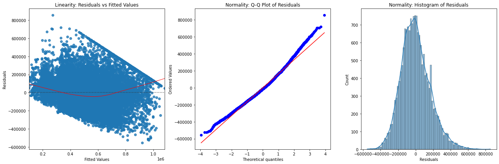

## Overview

In today's competitive real estate market, homeowners seek ways to maximize the value of their properties through renovations. This project aims to leverage linear regression modeling to provide insights into how different types of home renovations can affect the estimated value of homes. By analyzing historical sales data and applying regression techniques, we will quantify the impact of specific renovation projects on home prices, helping homeowners make data-driven decisions and real estate agents provide expert advice to their clients.

## Business Understanding

The primary objective of this project is to provide actionable insights to a real estate agency that assists homeowners in buying and selling properties. The agency's clients often inquire about the potential increase in home value resulting from various renovation projects. Therefore, this project aims to address the following key objectives:

1. Develop a Predictive Model: Create and validate a linear regression model that predicts the increase in home value based on the type and extent of renovations undertaken, ensuring its reliability and applicability to various property types and market conditions.

2. Quantify the Impact of Renovations: Determine how different types of home renovations contribute to the overall increase in property value by analyzing historical sales data and identifying the renovations that provide the highest return on investment.

## Data Understanding

This project utilizes the King County House Sales dataset, contained in the file named kc_house_data.csv. This dataset includes various features related to house sales, such as square footage, number of bedrooms and bathrooms, presence of a waterfront, view quality, year built, and renovation status. The dataset also provides the sale price of each property, which serves as the dependent variable in our regression modeling. Detailed descriptions of the column names can be found in the accompanying column_names.md file. The aim is to leverage this rich dataset to understand and quantify the impact of various home renovations on property values.

## Data Preparation

The data preparation process involved several critical steps to ensure data quality and relevance for modeling. Initially, the data was inspected for duplicates and missing values. No duplicates were found, and missing values were identified in three columns: waterfront, view, and yr_renovated. Missing values for categorical data (waterfront and view) were filled using the mode, while numerical data (yr_renovated) was filled using the mean. Features were selected based on correlation analysis and domain knowledge. The selected features for modeling included sqft_living, grade, sqft_above, and bathrooms, all of which showed significant positive correlations with the target variable (price) and were practically relevant in real estate valuation. To avoid clutter, pair plots and heatmaps visualization were generated for the selected features, further highlighting their relationships with price and identifying potential multicollinearity issues, particularly between sqft_living and sqft_above. Outliers were examined using box plots, revealing their presence across all selected features. And since outliers, especially on the higher end, could skew data distribution and impact model accuracy, we capped them while iterating the models to observe their impact. The comprehensive data preparation ensures that the selected features are relevant and that any data anomalies are addressed, laying a solid foundation for the subsequent modeling process.

### Correlation Matrix

### Outliers

## Modeling & Validation

The modeling process involved an iterative approach to evaluate and improve model performance based on key metrics: Mean Absolute Error (MAE), Mean Squared Error (MSE), and R-Squared (R²). Initially, four models were built without addressing outliers, multicollinearity, or scaling. Among these, Model 4 (with features sqft_living, grade, bathrooms, and sqft_above) performed best with the lowest errors and highest explanatory power **(Model 4 - MAE: 129160.6885549101, MSE: 27242617861.51876, R2: 0.560280766314314)**. Initial modelling also indicated that including additional relevant features improves model performance. Subsequent iterations involved addressing outliers by capping them, which improved the model's metrics significantly. However, addressing multicollinearity by dropping sqft_above did not enhance the performance, indicating the importance of this feature. Scaling predictors also did not impact the model's performance, as linear regression inherently adjusts for the scales of input features.

Further refinement included diagnosing the best-performing model (Model 4, under Iteration 2) for conformity to linear regression assumptions. The initial diagnosis indicated violations of linearity and normality. To address this and based on previous observations, further model iteration was performed with outliers removed, predictors scaled, price log transformed and an additional feature included (bedrooms). The refined Model 5 showed improved adherence to linear regression assumptions, with better linearity and normality. When predictions were transformed back to the original scale, **Model 5 achieved the best metrics: MAE of 123,967, MSE of 26,571,843,532, and R² of 0.568**, indicating the highest accuracy and explanatory power achieved yet. This iterative approach ensured the development of a robust and reliable linear regression model for predicting house prices.

### Model 4 Diagnosis

### Model 5 Diagnosis

## Conclusion

The iterative modeling process culminated in the development of a robust predictive model (Model 5) that estimates the increase in home value based on sqft_living, grade, sqft_above, bathrooms, and bedrooms as key features. The models R2 of 0.57 on the test set indictates that 57% of the variance in housing prices can be explained by these key features. This strong explanatory power between key features and home prices suggest that strategic renovations can substantially increase a property's value.

### Recommendations:

1. Focus on High-Impact Renovations: The agency should advise homeowners to prioritize renovations that significantly increase the living area, improve the quality of construction, and add more functional spaces such as bathrooms and bedrooms. These improvements are shown to have the most substantial impact on home value.

2. Use the Predictive Model for Client Consultations: Incorporate the predictive model into client consultations to provide data-driven estimates of potential home value increases from specific renovations. This will help homeowners make informed decisions about their renovation projects.

3. Market Insights: Utilize the insights from the model to identify market trends and property features that are most desirable to buyers. This can help the agency better position properties in the market and tailor marketing strategies to highlight key selling points.

By leveraging the predictive capabilities of the model, the agency can offer precise, actionable advice to homeowners, helping them maximize their return on investment from renovation projects. This not only enhances client satisfaction but also strengthens the agency's reputation as a knowledgeable and reliable real estate advisor.